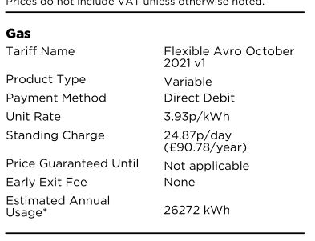

# ApxRefAnnualEstimates

This Appendix shows Octopus' own estimates of my annusl gas usage. These form the basis of estimation used in gas bills. 

## Summary

Estimates for annual use of gas at my house have been high since Octopus took over the account. From some of the bills shown in this section. The following values are typical by year.

| Date       | Annual Estimate (kWh) |
|------------|----------------------|
| 2022-07-27 | 26272 |
| 2023-12-22 | 26272 |
| 2024-04-29 | 26272 |
| 2025-03-29 | 26001 |

Annual esimates can be seen on all gas bills. kWh (as opposed to cost) estimates can generally be found on the RHS of page 2. 

{ width=40% }

## Details Show

Page 2 of the following (as emailed) bills are provided for reference here:
* octopus-energy-statement-2022-07-27.pdf
* octopus-energy-statement-2023-12-22.pdf
* octopus-energy-statement-2024-04-29.pdf
* octopus-energy-statement-2025-03-29.pdf
* octopus-energy-statement-2025-09-17.pdf
* octopus-energy-statement-2025-12-17.pdf
* octopus-energy-statement-2026-02-23.pdf
* octopus-energy-statement-2026-03-29.pdf

## Specifics wrt the refund complaint (XXX RC)

With particulsr respect to the Refund issue (sectionRefund)  a clear indication that the greates bias with respoect to over-estimates was in the earliest years (2022, 2023) of Octopus adminisration of the account,when rates rose to highs of - 16p per kWh before ghe application of Govt. subsidies.

It stands to reason, therefore, that a refund based solely on the short period (@ -6p/kWh) before the customer reading means the customer is effectively payimg Octopuz for their bloated account estimates.

Tgis is clearly an unacceptable state of affairs.
