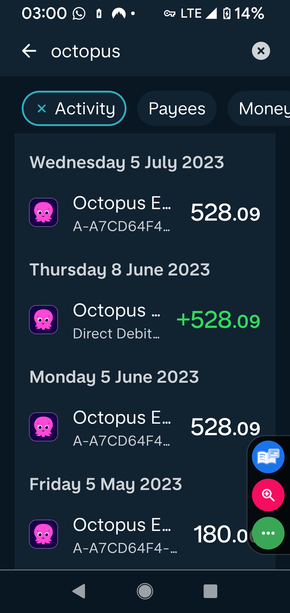

# Appendix ApxDD1

## Contents

This appendix contains screenshots, emails and other evidence relating to two occasions where Octopus took a Direct Debit amount contrary to clear instructions not to do so.

## Background

I do not object to Direct Debits in principle. Used properly, they are convenient for both the customer and the supplier. Minor amendments can be dealt with without excessive process, and a reasonable degree of flexibility can save time for all parties.

However, the Direct Debit scheme relies on mutual trust. A supplier should not overstep the mark in pursuit of its own commercial interests. It should also give sufficient notice of any proposed change, proportionate to the size of the change.

A customer may be able to absorb a small variation, such as £10 or £20, with relatively short notice. It is completely unreasonable to expect a customer to absorb hundreds of pounds in additional payments at short notice. In this context, I would regard around a week as short notice. For a substantial increase, I would expect around a full calendar month’s notice.

Each case is unique, but I was surprised that a professional organisation such as Octopus appeared not to apply that basic understanding. The Direct Debit scheme depends on consent, notice and trust. In this case, that trust was not respected.

## Details — 05-06-23: withdrawal of £528, agreed amount £300

{ width=20% }

As shown in the image above, £528 was taken on the date shown.

Please see the following emails in thread 1, regarding the proposed increase to my Direct Debit amount:

* **19 May** — Octopus sought authorisation to increase the Direct Debit amount to £528.09.
* **20 May** — I responded clearly that I was not authorising this at present. I also explained the information I would need in order to review the matter properly.
* **22 May** — Octopus responded, indicating that they could provide the information requested and specifically stating that they had not changed the Direct Debit without my consent.

Octopus then appears to have taken the increased amount, contrary to both my express refusal and their own written response.

In their response to me, Octopus stated:

> "... However, we would like to clarify that we did not set the direct debit amount without your consent. We suggested a change to your direct debit amount based on your energy consumption to ensure that your payments cover your usage and prevent any debit on your account. We understand that you would like to keep your direct debit amount the same, and we can certainly accommodate that request..."

That statement is important because it confirms Octopus understood that I did not consent to the increase, and that I wished to keep the Direct Debit amount the same.

The issue is therefore straightforward: Octopus proposed a substantial increase, I expressly refused to authorise it, Octopus acknowledged that position in writing, and the increased amount was then taken anyway.

Note: I did not refuse to engage with the issue. I explained that I needed further information before I could properly review the proposed increase. My expectation was that Octopus would provide the relevant information in a clear and structured way before making any such change.