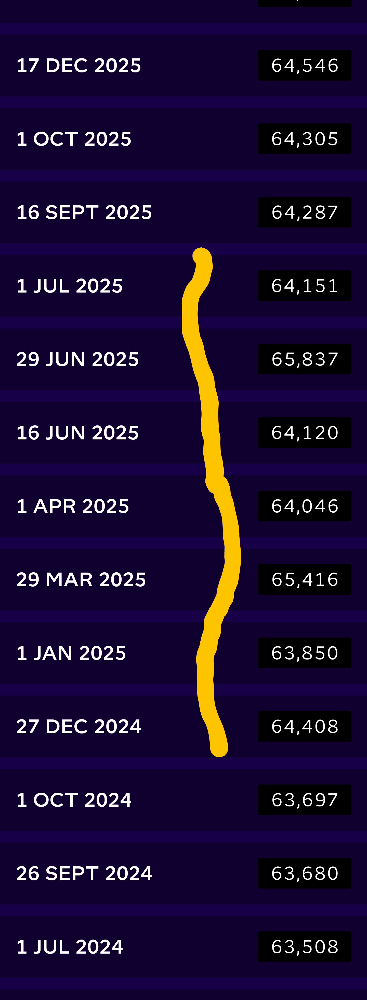

# Appendix # - Gas Readings in App - Explanation of How Up/Down Pattern Emerges

This appendix shows - using a spreadsheet - how the App Gas Readings (and therefore the Octo- internal system acquired the up/down readings pattern that is visible between 0ctober 2024 and June 2025 is the Gas Readings section of the Octopus Application.

In this appendix:

*   Screenshot of the very confusing Octopus App values for the aforementioned time period.
*   Speadsheet showing the (somewhat convoluted) mapping between the App Readings (see last point) the origins of the values and the bills shown ApxRefundBills.

## Octopus App gas readings Dec-24 to July-25

{width=50%}

The yellow line on the previous image shows the Octoput App gas readings around the time of the refunding of part of the overcharge due to over-estiamtes. The values between December 2024 and July 2025 go up and down, in a manner one would not associate with monotonically increasing gas meter readings.
